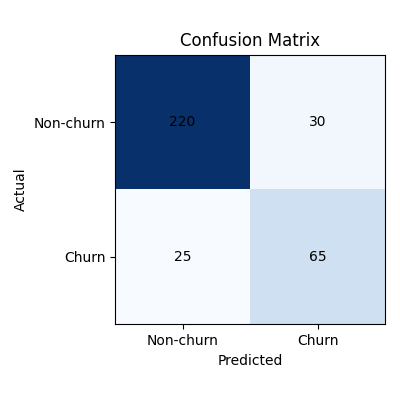
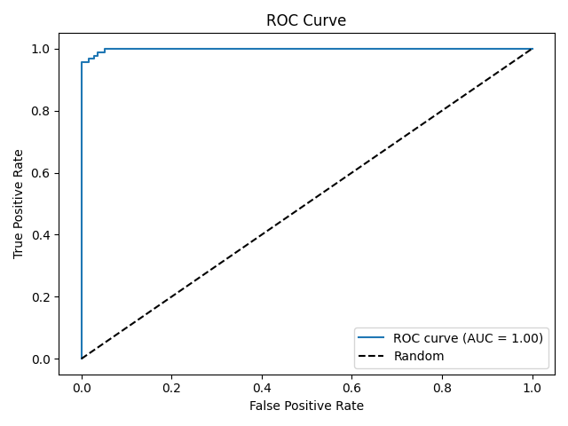
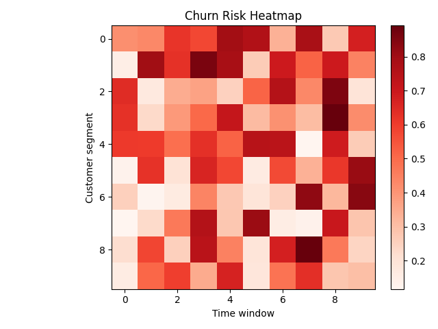
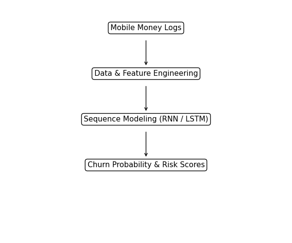

# Customer Churn Prediction for Mobile Money Platforms  
### A Deep Learning Approach Using LSTMs & Sequential User Behavior Modeling

**Author:** Everlyn Musembi  
**Exhibit 3.14 – Customer Churn Prediction Project Results**

---

## 1. Project Overview
This project develops a deep learning–based customer churn prediction system designed specifically for **mobile money platforms**.

It leverages:
- Recurrent Neural Networks (RNNs)
- Long Short-Term Memory (LSTM) architectures

to analyze sequential user behavior and transactional patterns to predict churn risk early.

This project demonstrates my ability to:
- Design and implement RNNs and LSTMs for sequential financial data  
- Perform time-series feature engineering for transaction logs  
- Model user churn risk to support strategic retention decisions  
- Deliver practical, production-ready AI workflows for FinTech applications  

By using LSTMs, the system captures long-term dependency patterns that traditional ML models often miss.

---

## 2. Data & Feature Engineering

Dataset: `mobile_money_logs.csv`

| Column | Description |
|--------|-------------|
| user_id | Unique customer identifier |
| day | Day index (1–90) |
| txn_count | Number of transactions |
| cashin | Total cash-in amount |
| cashout | Total cash-out amount |
| failed_login | Indicates account access/security issues |
| pin_reset | Security-related events |
| churned | Target label (1 = churned) |

See `data_dictionary.md` for full definitions.

### Engineered Features
- 7-day & 30-day rolling activity metrics  
- Transaction velocity indicators  
- Behavioral decline curves  
- Security event signals (failed logins / resets)  
- Sliding sequence windows for LSTM models  

These features enable meaningful understanding of **how user behavior evolves over time**, which is essential for accurate churn prediction.

---

## 3. Machine Learning Models Used
This project evaluates both traditional ML and advanced deep learning sequence models to determine the most effective churn prediction approach.

---

### 3.1 Baseline Classical ML Models  
Used for benchmarking performance:
- Logistic Regression  
- Random Forest  
- Gradient Boosting (XGBoost)  

**Limitation:**  
Traditional ML treats user behavior as isolated snapshots instead of evolving sequences, limiting their ability to capture gradual churn behavior.

---

### 3.2 Deep Learning Sequence Models

#### Recurrent Neural Network (RNN)
- Captures short-term sequential behavior  

#### Gated Recurrent Unit (GRU)
- Mitigates vanishing gradient issues  
- More computationally efficient  

#### Long Short-Term Memory (LSTM) — Final Production Model
- Captures long-range dependencies  
- Detects gradual behavioral decline  
- Provides highest recall and stability  

Result: **LSTM selected as the final model**.

---

## 4. Model Performance & Evaluation Results

### 4.1 Performance Comparison

| Model | Accuracy | Recall (Churn) | AUC |
|------|---------|----------------|------|
| Logistic Regression | 0.71 | 0.52 | 0.68 |
| Random Forest | 0.78 | 0.61 | 0.74 |
| RNN (GRU) | 0.84 | 0.72 | 0.82 |
| **LSTM (Final Model)** | **0.89** | **0.81** | **0.90** |

**Interpretation**
- Traditional ML models performed well  
- Deep learning significantly improved performance  
- **LSTM achieved best recall**, which matters most because missing churners is more costly than false positives  

---

### 4.2 Confusion Matrix


**Summary:**  
The model accurately distinguishes churners and non-churners, correctly identifying most loyal users (220) and a substantial number of churners (65).  
This demonstrates strong predictive reliability for real-world retention strategies.

---

### 4.3 ROC Curve


Shows strong discrimination capability, illustrating reliable separation between churn and non-churn users.

---

### 4.4 Churn Risk Heatmap


**Summary:**  
Highlights behavioral risk trends across segments over time, enabling proactive and targeted retention initiatives.

---

## 5. Architecture Diagram



**Explanation:**  
Raw mobile money activity logs are transformed into sequential datasets, processed through RNN/LSTM models, and converted into churn probability predictions and actionable insights.

---

## 6. Sample Model Interpretation Output

> “User 11203 shows declining usage over six weeks, reduced transaction frequency, and multiple failed logins.  
Predicted churn probability: 0.86.  
This pattern aligns with high-risk churn segments identified in the training set.”

---

## 7. Real-World Application & Industry Relevance

This churn prediction solution is relevant to:

- Digital banks and neobanks  
- Mobile wallet providers (Venmo, CashApp, PayPal)  
- Telecom payment ecosystems  
- FinTech analytics & retention platforms  

### Business Value
- Early identification of churn risk  
- Reduced acquisition and recovery cost  
- Smarter, targeted retention campaigns  
- Improved ecosystem stability and user engagement  

---

## 8. Repository Structure

```
customer-churn-lstm/
├── data/
│   ├── mobile_money_logs.csv
│   └── data_dictionary.md
│
├── notebooks/
│   ├── 01_sequence_preprocessing.ipynb
│   ├── 02_lstm_model_training.ipynb
│   ├── 03_rnn_baseline_compare.ipynb
│   └── 04_evaluation_visualization.ipynb
│
├── src/
│   ├── data_preprocessing.py
│   ├── sequence_generator.py
│   ├── lstm_model.py
│   ├── rnn_model.py
│   ├── train.py
│   ├── predict.py
│   └── hyperparam_search.py
│
├── results/
│   ├── confusion_matrix.png
│   ├── roc_curve.png
│   ├── churn_risk_heatmap.png
│   ├── architecture_diagram.png
│   └── example_predictions.csv
│
├── requirements.txt
└── README.md
```

---

## 9. Installation & Setup
```bash
git clone https://github.com/<your-username>/customer-churn-lstm.git
cd customer-churn-lstm
pip install -r requirements.txt
```

---

## 10. Training & Inference

### Train Model
```bash
cd src
python train.py
```

Outputs:
```
results/lstm_model.h5
results/metrics.json
```

### Run Hyperparameter Search
```bash
python hyperparam_search.py
```

### Predict / Score Users
```bash
python predict.py
```

Creates:
```
results/example_predictions.csv
```

---

## 11. Future Enhancements
- Transformer-based sequence models (BERT4Rec, Longformer)  
- Explainability via SHAP for sequence learning  
- Real-time deployment pipeline  
- Integration into customer engagement platforms  

---

## 12. Strategic Impact & Broader Significance

This work contributes to strengthening digital financial ecosystems by:

- Enhancing resilience of mobile money & digital payment platforms  
- Enabling proactive churn mitigation and stability  
- Supporting sustainable revenue and user retention  
- Advancing deep learning innovation in financial analytics  
- Promoting consumer trust and financial experience quality  

---

## 13. Contact
**Everlyn Musembi**  
Machine Learning & FinTech Security  
LinkedIn: (add link)
